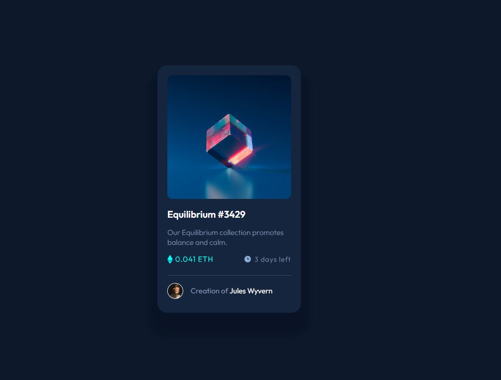

# Frontend Mentor - NFT preview card component solution

This is a solution to the [NFT preview card component challenge on Frontend Mentor](https://www.frontendmentor.io/challenges/nft-preview-card-component-SbdUL_w0U). Frontend Mentor challenges help you improve your coding skills by building realistic projects. 

## Table of contents

- [Overview](#overview)
  - [The challenge](#the-challenge)
  - [Screenshot](#screenshot)
  - [Links](#links)
- [My process](#my-process)
  - [Built with](#built-with)
  - [What I learned](#what-i-learned)
  - [Useful resources](#useful-resources)
- [Author](#author)

## Overview

### The challenge

Users should be able to:

- View the optimal layout depending on their device's screen size
- See hover states for interactive elements

### Screenshot

### Links

- Solution URL: [HTML](https://your-solution-url.com)
- Solution URL: [CSS](https://your-solution-url.com)
- Live Site URL: [LIVE SITE](https://your-live-site-url.com)

## My process

### Built with

- Semantic HTML5 markup
- CSS custom properties
- Flexbox
- Mobile-first workflow

### What I learned

By doing this priject I have learned the animation property and it's doings. It was a challenge for me to add the hover effect on the image. And finally I have done it simply adding some
oppacity values and later changing the effect with hover property.

### Useful resources

- [W3schools](https://www.w3schools.com/) - This helped me with the box-shadows property and it helped me to understand how it works.
- [ChatGPT](https://chat.openai.com/) - This is an amazing oppurtunity to make this bot as your assitant. It will help you solve little works here and there.

## Author

- Frontend Mentor - [@ZahidurRahman8759](https://www.frontendmentor.io/profile/ZahidurRahman8759)